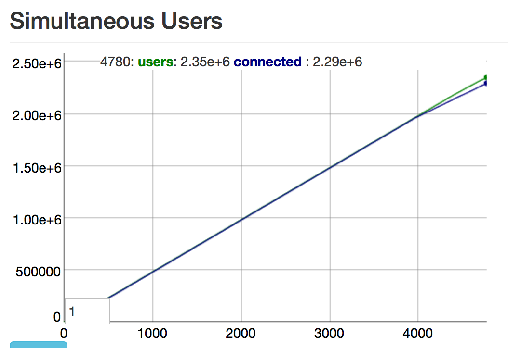
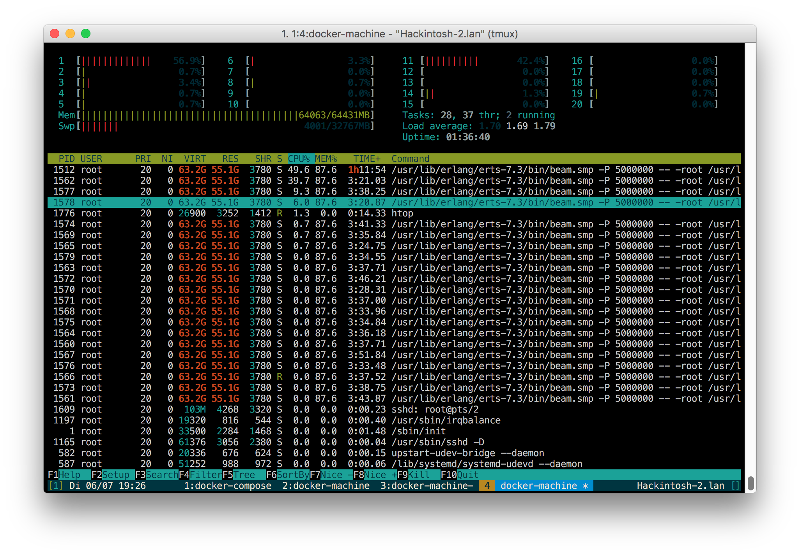

Phoenix Connection Benchmark
============================

This is a reproduction of the [2 million connections in Phoenix benchmark](http://www.phoenixframework.org/blog/the-road-to-2-million-websocket-connections) with the focus on making it repeatable by utilizing Docker Machine, Swarm and Compose.

**DISCLAIMER:** Like the original, this does not benchmark real use cases! It _only_ opens and maintains a lot of connections to one server.

## TL;DR

Jump to the [results](#results)

## Requirements

* Docker and Docker Compose
* Ruby
* DigitalOcean account

## Run the benchmark

Export your DigitalOcean API key (can also be set in in the configuration)
```
export DO_TOKEN=<your token>
```

Copy and edit the example configuration:
```
cp config.yml.example config.yml
```

Setup the droplets (this will take a few minutes depending on the amount of workers configured):
```
rake setup
```

When the setup is finished you will get IPs of the benchmark target and the Tsung master Droplet. Open the URLs in a browser, the sites will be available after starting the application.

Start the Phoenix Chat application on the Benchmark target, either by running `docker-machine ssh bench-target` and starting it from the shell, or by using this one line command: 
```
docker-machine ssh bench-target "cd chat; MIX_ENV=prod PORT=4000 iex --name bench@127.0.0.1 --cookie 123 --erl '+P 5000000 -kernel inet_dist_listen_min 9001 inet_dist_listen_max 9001' -S mix phoenix.server"
```
Reload the browser tab and test if the application works.

Run `docker-compose up` to start the Tsung cluster. It will first wait for all slaves to be available and then run the benchmark.

Reload the Tsung master browser tab and watch the graphs :)

After you are done stop and remove the droplets:

```
rake teardown
```

### Results

The benchmark was run with this [example configuration](config.yml.example), the [provisioning script of the server](files/setup_chat.sh), and a [patch](https://github.com/dsander/phoenix-connection-benchmark) to the [phoenix_chat_example](https://github.com/chrismccord/phoenix_chat_example) of @chrismccord. On the largest available Droplet with 64GB of RAM and 20 CPU cores Phoenix was able to accept and maintain __2.3 million__ websocket connections. The limit was the amount of available memory, the arrival rate dropped after the server starting swapping.





### Lessons learned

* Phoenix, Elixir and/or Erlang got HUGE memory efficiency improvements within the last months, the previous benchmark needed around 84GB RAM for 2 million connection, which was reduced to 64GB!
* The Tsung slave nodes need around 3.8GB RAM to maintain 60k connections, a larger arrival rate does not work because only 1 CPU was available.
* Docker Overlay networking is a bigger overhead then expected, running the Tsung slaves without docker would probably allow a higher arrival rate.
* This kind of benchmark is cheaper then one would expect. A full run (including setup and tear down) took less then 2 hours and thus costs less then 7$